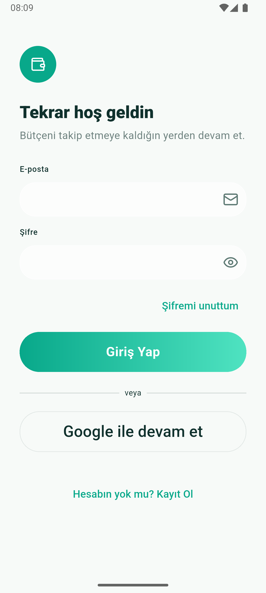
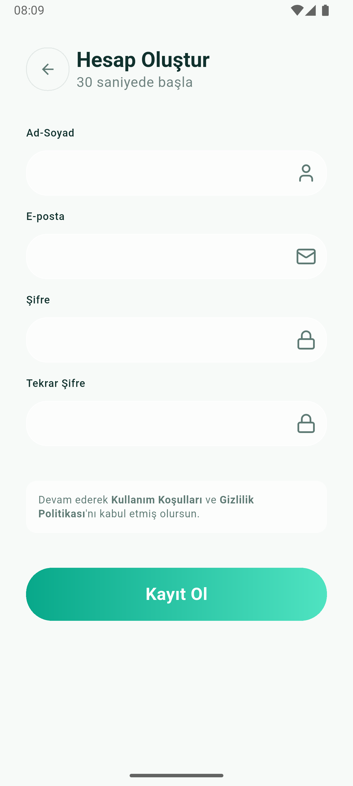
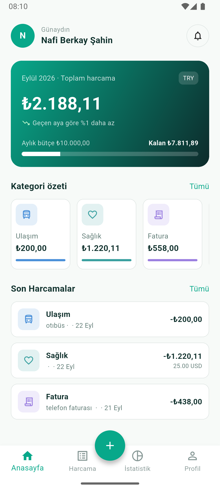
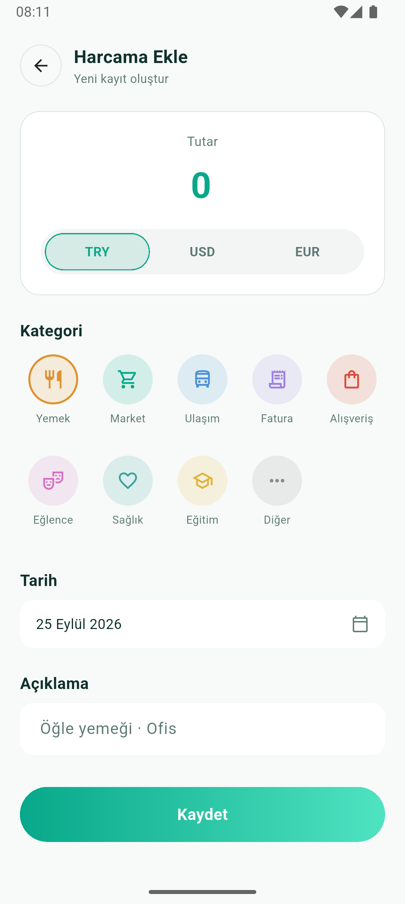
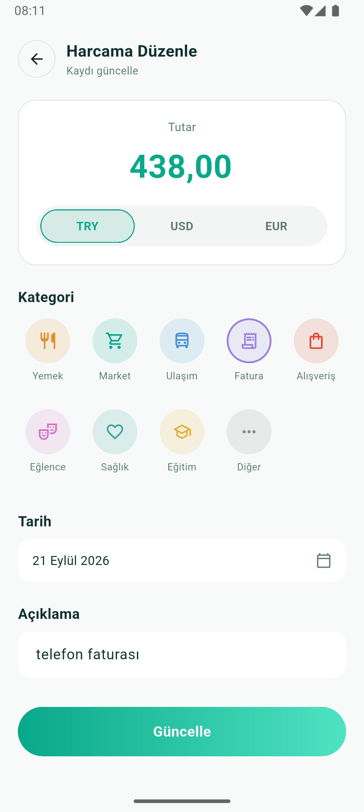
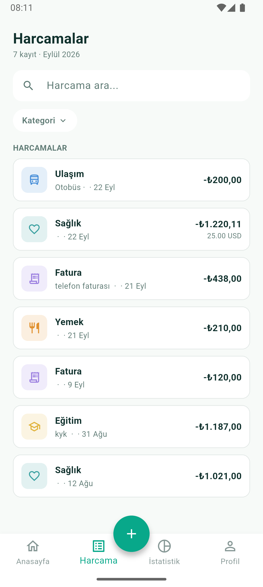
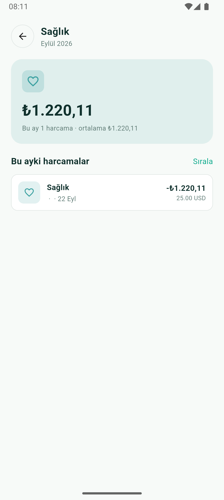
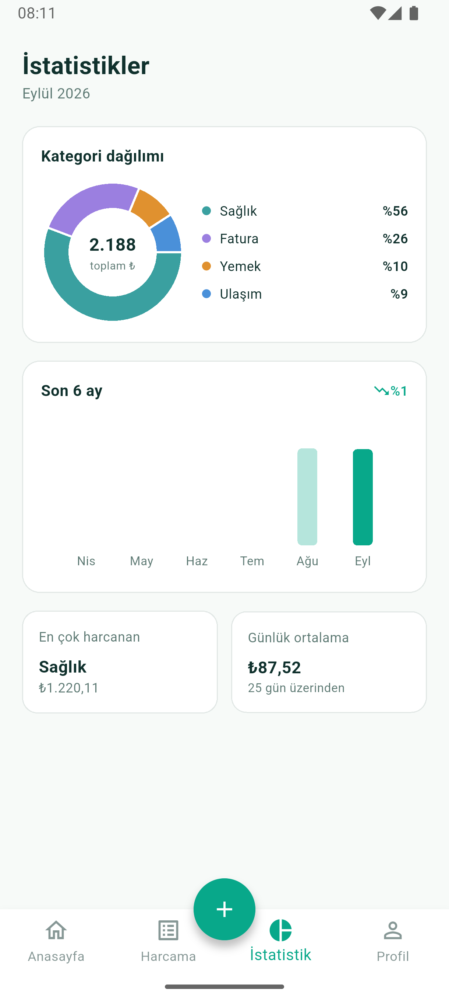
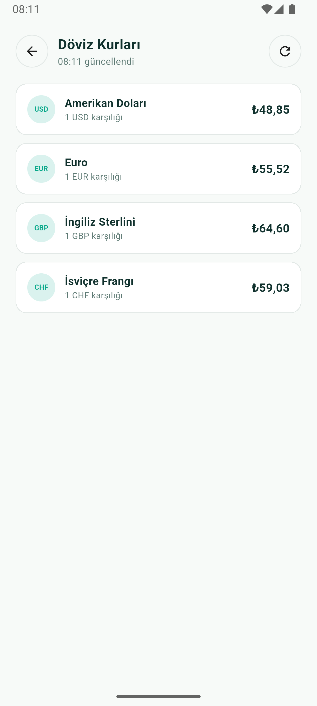
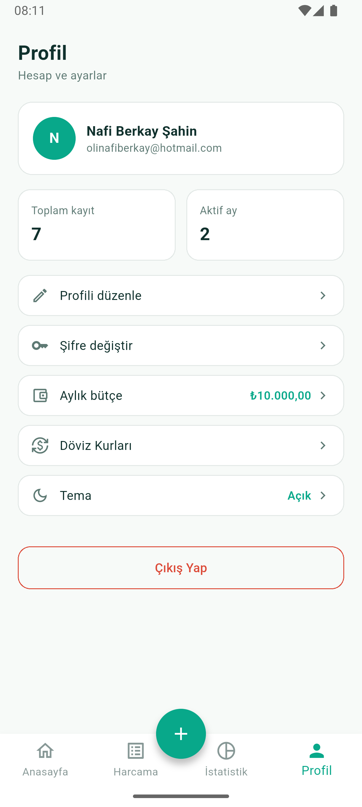

# Seyv — Harcama ve Bütçe Takip Uygulaması

Flutter ve Firebase ile geliştirilmiş, kullanıcıların günlük harcamalarını kategori bazlı takip edebildiği, bütçe belirleyebildiği ve güncel döviz kurlarıyla dövizli harcama girebildiği bir mobil uygulama.

Bu proje, Flutter ile mobil uygulama geliştirme sürecini baştan sona deneyimlemek amacıyla staj kapsamında geliştirilmiştir.

## Projenin Amacı

Kullanıcı hesap oluşturup giriş yaptıktan sonra:
- Harcamalarını kategori, tarih, tutar ve açıklama bilgileriyle kaydedebilir
- Harcamalarını listeleyebilir, düzenleyebilir, silebilir
- Kategori bazlı ve aylık istatistiklerini (pasta grafik, 6 aylık çubuk grafik) görebilir
- Aylık bütçe belirleyip harcamalarını bu bütçeyle karşılaştırabilir
- USD/EUR gibi yabancı para birimleriyle harcama girebilir, uygulama güncel kur üzerinden TL karşılığını otomatik hesaplar
- Güncel döviz kurlarını (USD, EUR, GBP, CHF) görüntüleyebilir

Her kullanıcının verisi yalnızca kendisine özeldir; bu, hem uygulama kodunda hem Firestore Security Rules ile veritabanı seviyesinde garanti altına alınmıştır.

## Kullanılan Teknolojiler

| Teknoloji | Kullanım Amacı |
|---|---|
| Flutter / Dart | Mobil uygulama geliştirme |
| Firebase Authentication | Kullanıcı kayıt / giriş / çıkış |
| Cloud Firestore | Harcama, kullanıcı ve bütçe verilerinin bulutta saklanması |
| flutter_bloc (Cubit) | State management |
| go_router | Sayfalar arası yönlendirme |
| fl_chart | İstatistik ekranındaki pasta ve çubuk grafikler |
| http | Frankfurter API ile REST istekleri |
| intl | Tarih ve para birimi formatlama (tr_TR) |
| shared_preferences | Tema tercihinin cihazda kalıcı saklanması |

## Firebase Kurulumu

1. Firebase Console (console.firebase.google.com) üzerinden yeni bir proje oluşturulur.
2. Authentication bölümünden Email/Password giriş yöntemi aktif edilir.
3. Firestore Database bölümünden bir veritabanı oluşturulur (bu projede eur3 (Europe) bölgesi seçilmiştir).
4. `flutterfire configure` komutu ile proje Firebase'e bağlanır, bu işlem `lib/firebase_options.dart` dosyasını otomatik oluşturur.
5. Firestore Security Rules, aşağıdaki "Firestore Veri Modeli ve Güvenlik" bölümünde açıklanan kurallarla güncellenip yayınlanır.

## Authentication Yapısı

- Kayıt ve giriş `firebase_auth` paketi ile Email/Password yöntemiyle yapılır.
- `AuthCubit` (Cubit pattern), `signUp`, `signIn`, `signOut` işlemlerini yönetir; durumlar `AuthInitial`, `AuthLoading`, `AuthSuccess`, `AuthError` olarak modellenmiştir.
- Firebase'in ham hata mesajları, `lib/utils/auth_error_translator.dart` ile kullanıcıya anlaşılır Türkçe mesajlara çevrilir (ör. "email-already-in-use" -> "Bu e-posta adresi zaten kullanımda.").
- Uygulama açıldığında `SplashScreen`, `FirebaseAuth` üzerinden oturum durumunu kontrol edip kullanıcıyı Ana Ekran'a veya Giriş ekranına yönlendirir.
- Kayıt sırasında alınan ad-soyad bilgisi, Firebase Auth'un `displayName` alanı yerine Firestore'daki `users/{userId}` dokümanında saklanır (bkz. veri modeli).

## Firestore Veri Modeli ve Güvenlik

### expenses koleksiyonu

Her doküman bir harcamayı temsil eder:

```
expenses/{expenseId}
  userId: string          -> harcamanın sahibi olan kullanıcının uid'si
  categoryName: string    -> Yemek, Market, Ulaşım, Fatura, Alışveriş, Eğlence, Sağlık, Eğitim, Diğer
  description: string
  location: string
  date: timestamp
  amount: number           -> her zaman TL karşılığı
  currency: string         -> 'TRY', 'USD' veya 'EUR'
  exchangeRate: number?    -> dövizli girişlerde kayıt anındaki kur (TRY girişlerde null)
  originalAmount: number?  -> dövizli girişlerde girilen orijinal tutar (TRY girişlerde null)
```

### users koleksiyonu

Her doküman, doküman ID'si kullanıcının uid'si olacak şekilde tek bir kullanıcıyı temsil eder:

```
users/{userId}
  name: string
  monthlyBudget: number
```

### Security Rules

```
rules_version = '2';

service cloud.firestore {
  match /databases/{database}/documents {

    match /expenses/{expenseId} {
      allow read, delete: if request.auth != null
                           && request.auth.uid == resource.data.userId;

      allow create: if request.auth != null
                     && request.auth.uid == request.resource.data.userId;

      allow update: if request.auth != null
                     && request.auth.uid == resource.data.userId
                     && request.auth.uid == request.resource.data.userId;
    }

    match /users/{userId} {
      allow read, write: if request.auth != null
                          && request.auth.uid == userId;
    }
  }
}
```

Bu kurallar sayesinde bir kullanıcı, kendi uid'si dışındaki hiçbir harcama veya kullanıcı dokümanına erişemez.

## Kullanılan REST API

Döviz kurları Frankfurter API (frankfurter.dev) üzerinden, API anahtarı gerektirmeden çekilir.

```
GET https://api.frankfurter.dev/v1/latest?base=TRY&symbols=USD,EUR,GBP,CHF
```

API, "1 TRY kaç yabancı para eder" oranını döndürdüğü için, uygulama içinde bu değerin tersi (1 / value) alınarak "1 yabancı para kaç TL eder" haline çevrilir. İstek `http` paketiyle atılır, `ExchangeRateService` -> `ExchangeRateRepository` -> `ExchangeRateCubit` katmanlarından geçerek ekranlara ulaşır.

## Uygulama Mimarisi

Katmanlı mimari kullanılmıştır:

```
UI (Screens/Widgets) -> Cubit -> Repository -> Service -> Firebase / REST API
```

- Service: Firebase veya API ile ham iletişimi kurar (FirestoreService, FirebaseAuthService, ExchangeRateService).
- Repository: İlgili Service'i sarmalayan ince bir katmandır; Cubit'in kullandığı arayüzü sağlar.
- Cubit (flutter_bloc): State yönetimini üstlenir. Her özellik kendi state sınıfına sahiptir (AuthState, ExpenseState, BudgetState, ExchangeRateState), state'ler sealed class ile Initial/Loading/Loaded(Success)/Error olarak modellenmiştir.
- UI: BlocBuilder/BlocConsumer ile Cubit'i dinler, kullanıcı etkileşimlerini Cubit'e iletir.

Harcama listesi gibi sürekli güncellenmesi gereken veriler (ExpenseCubit, BudgetCubit) Firestore'un Stream desteğiyle gerçek zamanlı dinlenir; bir harcama eklenip silindiğinde listeler otomatik güncellenir. Döviz kurları ve auth işlemleri gibi tek seferlik işlemler ise Future ile yönetilir.

Sayfa yönlendirmeleri tamamen go_router ile yapılır. Harcama Ekle ekranı, bottom navigation sekmesi değil ayrı bir route (/expense-add) olarak tasarlanmıştır; ana sayfada ortalanmış bir FAB (+ butonu) ile açılır ve go_router'ın extra parametresiyle mevcut bir harcama gönderildiğinde düzenleme moduna geçer.

## Klasör Yapısı

```
lib/
  main.dart
  firebase_options.dart

  models/              -> Expense, CategoryData, TransactionData, ExchangeRate
  services/             -> FirestoreService, FirebaseAuthService, BudgetService,
                           UserService, ExchangeRateService
  repositories/         -> ExpenseRepository, AuthRepository, BudgetRepository,
                           UserRepository, ExchangeRateRepository
  blocs/
    auth/
    expense/
    budget/
    exchange_rate/
    theme/

  screens/
    auth/             -> login_screen, register_screen
    splash_screen.dart
    main_shell.dart          -> BottomNavigationBar + IndexedStack + FAB
    home_screen.dart
    expense_add_screen.dart  -> hem ekleme hem düzenleme modu
    expense_list_screen.dart
    category_detail_screen.dart
    statistics_screen.dart
    exchange_rates_screen.dart
    profile_screen.dart

  widgets/              -> AppTextField, AppGradientButton, CategoryCard, TransactionTile
  theme/                -> app_theme.dart (açık/koyu renk paleti)
  utils/                -> CategoryStyles (kategori-ikon/renk eşleştirmesi),
                           auth_error_translator
  routes/               -> app_router.dart

test/
  models/               -> expense_test.dart
  utils/                -> category_style_test.dart, auth_error_translator_test.dart
```

## Kullanılan Paketler

pubspec.yaml içindeki başlıca bağımlılıklar:

- firebase_core, firebase_auth, cloud_firestore — Firebase entegrasyonu
- flutter_bloc — state management
- go_router — navigasyon
- http — REST API istekleri
- fl_chart — istatistik grafikleri
- intl — tarih/para birimi formatlama
- shared_preferences — tema tercihi kalıcılığı
- flutter_lucide — ikon seti (auth formlarında)

## Projenin Nasıl Çalıştırılacağı

1. Bağımlılıkları yükle:
```
flutter pub get
```
2. Kendi Firebase projeni bağlamak için:
```
flutterfire configure
```
3. Uygulamayı çalıştır:
```
flutter run
```
4. Testleri çalıştırmak için:
```
flutter test
```

## Testler

test/ klasöründe, Firebase/widget kurulumu gerektirmeyen unit testler bulunur:
- Expense.toMap() / Expense.fromMap() dönüşümlerinin doğruluğu
- CategoryStyles.of() eşleştirmesi ve bilinmeyen kategori için varsayılan davranış
- Auth hata kodlarının doğru Türkçe mesaja çevrilmesi

## Ekran Görüntüleri

## Ekran Görüntüleri

| Giriş | Kayıt Ol | Ana Ekran |
|---|---|---|
|  |  |  |

| Harcama Ekle | Harcama Düzenle | Harcamalar |
|---|---|---|
|  |  |  |

| Kategori Detay | İstatistik | Döviz Kurları |
|---|---|---|
|  |  |  |

| Profil |
|---|
|  |