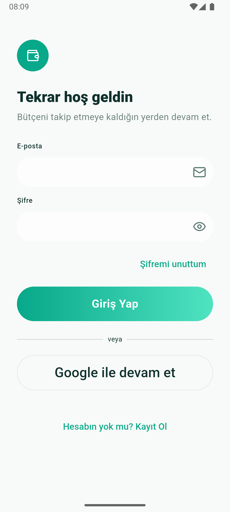
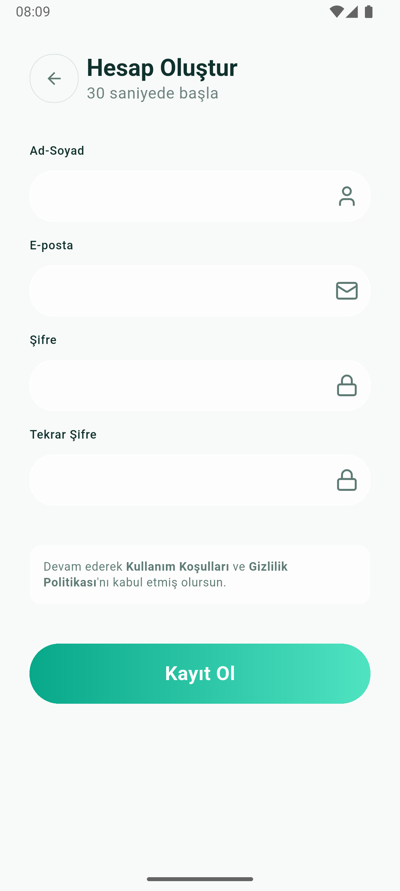
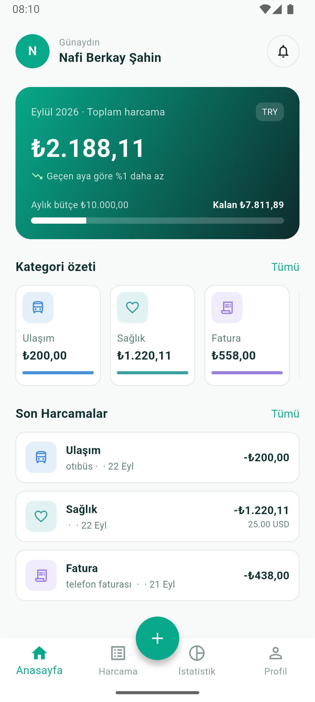
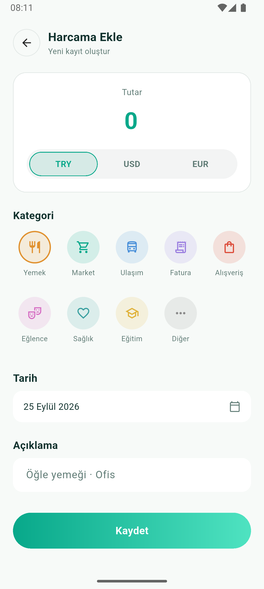
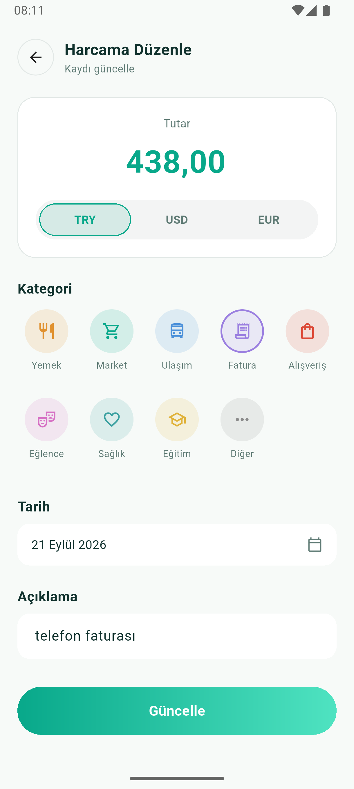
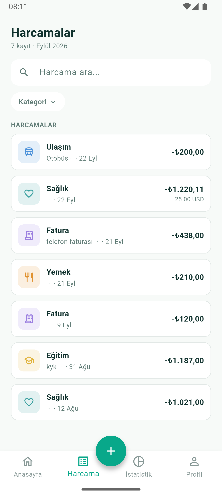
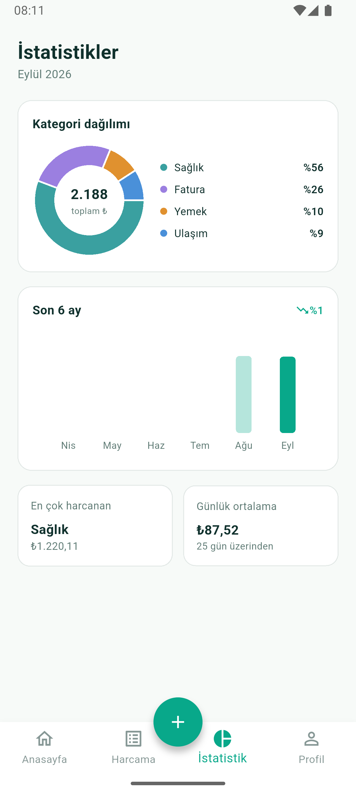
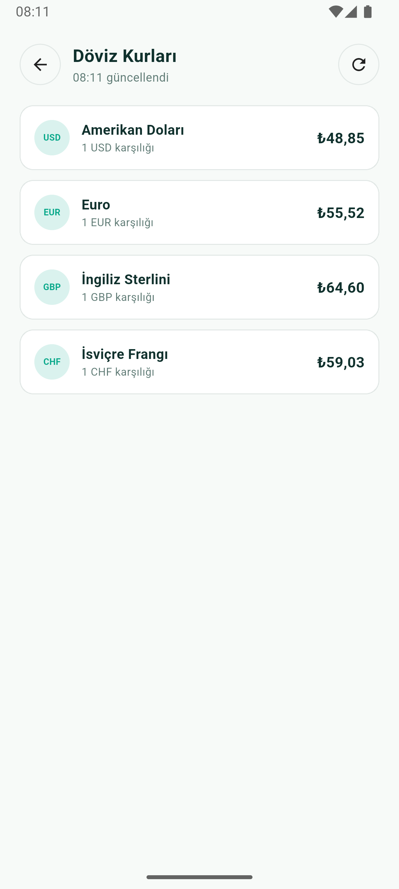
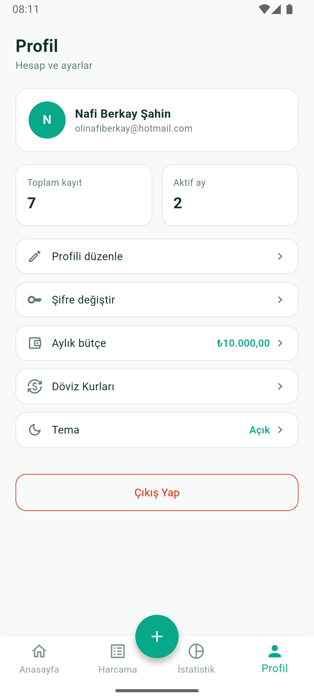

# Seyv — Harcama ve Bütçe Takip Uygulaması

Flutter ve Firebase ile geliştirilmiş, kullanıcıların günlük harcamalarını kategori bazlı takip edebildiği, bütçe belirleyebildiği ve güncel döviz kurlarıyla dövizli harcama girebildiği bir mobil uygulama.

Bu proje, Flutter ile mobil uygulama geliştirme sürecini baştan sona deneyimlemek amacıyla staj kapsamında geliştirilmiştir.

## Projenin Amacı

Kullanıcı hesap oluşturup giriş yaptıktan sonra:
- Harcamalarını kategori, tarih, tutar ve açıklama bilgileriyle kaydedebilir
- Harcamalarını listeleyebilir, düzenleyebilir, silebilir
- Kategori bazlı ve aylık istatistiklerini (pasta grafik, 6 aylık çubuk grafik) görebilir
- Aylık bütçe belirleyip harcamalarını bu bütçeyle karşılaştırabilir
- Her kategori için ayrı aylık limit belirleyebilir; kategori limitlerinin toplamı aylık bütçeyi aşamaz
- USD/EUR gibi yabancı para birimleriyle harcama girebilir, uygulama güncel kur üzerinden TL karşılığını otomatik hesaplar
- Güncel döviz kurlarını (USD, EUR, GBP, CHF) görüntüleyebilir
- Profil ekranından şifresini değiştirebilir (mevcut şifresini doğrulayarak)
- Hesabını ve hesabına bağlı tüm harcama verilerini kalıcı olarak silebilir

Her kullanıcının verisi yalnızca kendisine özeldir; bu, hem uygulama kodunda hem Firestore Security Rules ile veritabanı seviyesinde garanti altına alınmıştır.

## Kullanılan Teknolojiler

| Teknoloji | Kullanım Amacı |
|---|---|
| Flutter / Dart | Mobil uygulama geliştirme |
| Firebase Authentication | Kullanıcı kayıt / giriş / çıkış |
| Cloud Firestore | Harcama, kullanıcı ve bütçe verilerinin bulutta saklanması |
| flutter_bloc (Cubit) | State management |
| go_router | Sayfalar arası yönlendirme |
| fl_chart | İstatistik ekranındaki pasta ve çubuk grafikler |
| http | Frankfurter API ile REST istekleri |
| intl | Tarih ve para birimi formatlama (tr_TR) |
| shared_preferences | Tema tercihinin cihazda kalıcı saklanması |

## Firebase Kurulumu

1. Firebase Console (console.firebase.google.com) üzerinden yeni bir proje oluşturulur.
2. Authentication bölümünden Email/Password giriş yöntemi aktif edilir.
3. Firestore Database bölümünden bir veritabanı oluşturulur (bu projede eur3 (Europe) bölgesi seçilmiştir).
4. `flutterfire configure` komutu ile proje Firebase'e bağlanır, bu işlem `lib/firebase_options.dart` dosyasını otomatik oluşturur.
5. Firestore Security Rules, aşağıdaki "Firestore Veri Modeli ve Güvenlik" bölümünde açıklanan kurallarla güncellenip yayınlanır.

## Authentication Yapısı

Auth ile ilgili her şey `lib/features/auth/` altındadır:

```
lib/features/auth/
  auth_service.dart        -> FirebaseAuthService: firebase_auth ile ham iletişim
  auth_repository.dart     -> AuthRepository: service'i sarmalar
  cubit/
    auth_cubit.dart        -> AuthCubit
    auth_state.dart        -> AuthInitial, AuthLoading, AuthSuccess, AuthError
  screens/
    splash_screen.dart
    login_screen.dart
    register_screen.dart
  widgets/
    forgot_password_dialog.dart
```

- Kayıt ve giriş `firebase_auth` paketi ile Email/Password yöntemiyle yapılır.
- `AuthCubit` (`lib/features/auth/cubit/auth_cubit.dart`), `signUp`, `signIn`, `signOut` işlemlerini yönetir; durumlar `auth_state.dart` içinde sealed class ile `AuthInitial`, `AuthLoading`, `AuthSuccess`, `AuthError` olarak modellenmiştir. Cubit ayrıca şifre sıfırlama e-postası, yeniden kimlik doğrulama, e-posta/şifre güncelleme, e-posta doğrulama ve hesap silme çağrılarını `AuthRepository`'ye iletir.
- Firebase'in ham hata mesajları, `lib/core/utils/auth_error_translator.dart` ile kullanıcıya anlaşılır Türkçe mesajlara çevrilir (ör. "email-already-in-use" -> "Bu e-posta adresi zaten kullanımda.").
- Uygulama `/splash` rotasıyla açılır (`lib/app/app_router.dart`); `SplashScreen`, `FirebaseAuth` üzerinden oturum durumunu kontrol edip kullanıcıyı Ana Ekran'a (`/home`) veya Giriş ekranına (`/login`) yönlendirir.
- "Şifremi unuttum" diyaloğu `lib/features/auth/widgets/forgot_password_dialog.dart` içindedir; şifre değiştirme, profil düzenleme ve hesap silme akışları profil ekranında (`lib/features/profile/`) yer alır ve `AuthCubit`'i kullanır.
- Kayıt sırasında alınan ad-soyad bilgisi, Firebase Auth'un `displayName` alanı yerine Firestore'daki `users/{userId}` dokümanında saklanır (bkz. veri modeli); bu işlem `lib/features/profile/user_repository.dart` üzerinden yapılır.

## Firestore Veri Modeli ve Güvenlik

### expenses koleksiyonu

Her doküman bir harcamayı temsil eder:

```
expenses/{expenseId}
  userId: string          -> harcamanın sahibi olan kullanıcının uid'si
  categoryName: string    -> Yemek, Market, Ulaşım, Fatura, Alışveriş, Eğlence, Sağlık, Eğitim, Diğer
  description: string
  location: string
  date: timestamp
  amount: number           -> her zaman TL karşılığı
  currency: string         -> 'TRY', 'USD' veya 'EUR'
  exchangeRate: number?    -> dövizli girişlerde kayıt anındaki kur (TRY girişlerde null)
  originalAmount: number?  -> dövizli girişlerde girilen orijinal tutar (TRY girişlerde null)
```

### users koleksiyonu

Her doküman, doküman ID'si kullanıcının uid'si olacak şekilde tek bir kullanıcıyı temsil eder:

```
users/{userId}
  name: string                 -> ad-soyad
  monthlyBudget: number        -> aylık toplam bütçe (TL)
  categoryBudgets: map         -> kategori adı -> o kategorinin aylık limiti (TL)
    Yemek: number
    Market: number
    ...
```

- `name` alanını `lib/features/profile/user_service.dart` yazar ve okur.
- `monthlyBudget` ve `categoryBudgets` birlikte bütçe planını oluşturur; uygulamada `BudgetPlan` modeline (`lib/features/budget/budget_plan.dart`) karşılık gelir: `monthlyBudget` -> `BudgetPlan.monthly`, `categoryBudgets` -> `BudgetPlan.categoryLimits`.
- `categoryBudgets` içinde yalnızca limiti olan kategoriler bulunur; limiti kaldırılan (0 girilen) kategori map'ten silinir. Okurken 0 veya sayı olmayan değerler yok sayılır, alanlar hiç yoksa plan boş kabul edilir (aylık bütçe 0, limit yok).
- Kural: kategori limitlerinin toplamı aylık bütçeyi aşamaz. Bu kural uygulama tarafında `BudgetPlan.isValid` ile denetlenir; geçersiz plan kaydedilemez.
- Plan `lib/features/budget/budget_service.dart` içinde `SetOptions(mergeFields: ['monthlyBudget', 'categoryBudgets'])` ile yazılır: bu iki alan tamamen değiştirilir, `name` gibi diğer alanlara dokunulmaz.
- Hesap silindiğinde kullanıcının `users/{userId}` dokümanı ve tüm `expenses` dokümanları da silinir.

### Security Rules

```
rules_version = '2';

service cloud.firestore {
  match /databases/{database}/documents {

    match /expenses/{expenseId} {
      allow read, delete: if request.auth != null
                           && request.auth.uid == resource.data.userId;

      allow create: if request.auth != null
                     && request.auth.uid == request.resource.data.userId;

      allow update: if request.auth != null
                     && request.auth.uid == resource.data.userId
                     && request.auth.uid == request.resource.data.userId;
    }

    match /users/{userId} {
      allow read, write: if request.auth != null
                          && request.auth.uid == userId;
    }
  }
}
```

Bu kurallar sayesinde bir kullanıcı, kendi uid'si dışındaki hiçbir harcama veya kullanıcı dokümanına erişemez.

## Kullanılan REST API

Döviz kurları Frankfurter API (frankfurter.dev) üzerinden, API anahtarı gerektirmeden çekilir.

```
GET https://api.frankfurter.dev/v1/latest?base=TRY&symbols=USD,EUR,GBP,CHF
```

API, "1 TRY kaç yabancı para eder" oranını döndürdüğü için, uygulama içinde bu değerin tersi (1 / value) alınarak "1 yabancı para kaç TL eder" haline çevrilir. İstek `http` paketiyle atılır, `ExchangeRateService` -> `ExchangeRateRepository` -> `ExchangeRateCubit` katmanlarından geçerek ekranlara ulaşır.

## Uygulama Mimarisi

Katmanlı mimari kullanılmıştır:

```
UI (Screens/Widgets) -> Cubit -> Repository -> Service -> Firebase / REST API
```

- Service: Firebase veya API ile ham iletişimi kurar (FirestoreService, FirebaseAuthService, ExchangeRateService).
- Repository: İlgili Service'i sarmalayan ince bir katmandır; Cubit'in kullandığı arayüzü sağlar.
- Cubit (flutter_bloc): State yönetimini üstlenir. Her özellik kendi state sınıfına sahiptir (AuthState, ExpenseState, BudgetState, ExchangeRateState), state'ler sealed class ile Initial/Loading/Loaded(Success)/Error olarak modellenmiştir.
- UI: BlocBuilder/BlocConsumer ile Cubit'i dinler, kullanıcı etkileşimlerini Cubit'e iletir.

Harcama listesi gibi sürekli güncellenmesi gereken veriler (ExpenseCubit, BudgetCubit) Firestore'un Stream desteğiyle gerçek zamanlı dinlenir; bir harcama eklenip silindiğinde listeler otomatik güncellenir. Döviz kurları ve auth işlemleri gibi tek seferlik işlemler ise Future ile yönetilir.

Sayfa yönlendirmeleri tamamen go_router ile yapılır. Harcama Ekle ekranı, bottom navigation sekmesi değil ayrı bir route (/expense-add) olarak tasarlanmıştır; ana sayfada ortalanmış bir FAB (+ butonu) ile açılır ve go_router'ın extra parametresiyle mevcut bir harcama gönderildiğinde düzenleme moduna geçer.

## Klasör Yapısı

Proje "feature-first" düzendedir: her özellik kendi ekranını, widget'larını, cubit'ini, repository'sini, service'ini ve modelini kendi klasöründe tutar. Birden fazla özelliğin kullandığı kod `core/`, uygulama kurulumu `app/` altındadır.

```
lib/
  main.dart                  -> sadece main(): Firebase + tarih yerelleştirmesi
  firebase_options.dart      -> flutterfire configure üretir (repoda yer almaz)

  app/
    app.dart                 -> MyApp: global Cubit'ler, tema, MaterialApp.router
    app_router.dart          -> go_router rota tanımları
    main_shell.dart          -> BottomNavigationBar + IndexedStack + FAB

  core/
    theme/                   -> app_theme.dart (açık/koyu renk paleti), theme_cubit.dart
    utils/                   -> category_style.dart (kategori-ikon/renk eşleştirmesi),
                                auth_error_translator.dart
    models/                  -> category_data.dart, transaction_data.dart
    widgets/                 -> app_text_field, app_gradient_button, app_snackbar,
                                app_confirm_dialog, app_back_header,
                                category_card, transaction_tile

  features/
    auth/
      auth_service.dart, auth_repository.dart
      cubit/                 -> auth_cubit, auth_state
      screens/               -> splash_screen, login_screen, register_screen
      widgets/               -> forgot_password_dialog

    home/
      home_screen.dart
      widgets/               -> greeting_header, balance_card, category_summary_row,
                                recent_expenses_section

    expenses/
      expense.dart           -> Expense modeli
      expense_transaction_data.dart  -> Expense -> TransactionData dönüşümü
      firestore_service.dart, expense_repository.dart
      cubit/                 -> expense_cubit, expense_state
      screens/               -> expense_list_screen,
                                expense_add_screen (hem ekleme hem düzenleme modu)
      widgets/               -> expense_list_header, expense_filter_bar,
                                expense_filter_sheet, option_picker_sheet,
                                grouped_expense_list, amount_card,
                                category_picker_grid, date_field

    budget/
      budget_plan.dart       -> BudgetPlan modeli
      budget_formatters.dart
      budget_service.dart, budget_repository.dart
      cubit/                 -> budget_cubit, budget_state,
                                budget_plan_cubit, budget_plan_state
      screens/               -> budget_plan_screen, category_detail_screen
      widgets/               -> monthly_budget_card, budget_info_box,
                                category_limit_row, amount_input_dialog

    statistics/
      statistics_screen.dart
      widgets/               -> category_distribution_card, six_month_chart_card,
                                top_category_card, daily_average_card

    profile/
      profile_screen.dart
      user_service.dart, user_repository.dart
      widgets/               -> profile_header_card, profile_stats_row, settings_row,
                                logout_button, edit_profile_dialog,
                                change_password_dialog, password_confirm_dialog,
                                theme_picker_sheet

    exchange_rates/
      exchange_rates_screen.dart
      currency_info.dart
      exchange_rate_service.dart, exchange_rate_repository.dart
      cubit/                 -> exchange_rate_cubit, exchange_rate_state
      widgets/               -> quick_converter, rate_tile

test/                        -> lib/ yapısını yansıtır
  core/utils/                -> auth_error_translator_test.dart, category_style_test.dart
  features/
    expenses/                -> expense_test.dart
    budget/                  -> budget_plan_test.dart
```

## Kullanılan Paketler

pubspec.yaml içindeki başlıca bağımlılıklar:

- firebase_core, firebase_auth, cloud_firestore — Firebase entegrasyonu
- flutter_bloc — state management
- go_router — navigasyon
- http — REST API istekleri
- fl_chart — istatistik grafikleri
- intl — tarih/para birimi formatlama
- shared_preferences — tema tercihi kalıcılığı
- flutter_lucide — ikon seti (auth formlarında)

## Projenin Nasıl Çalıştırılacağı

> **Not:** `lib/firebase_options.dart` ve `android/app/google-services.json` dosyaları repoda yer almaz (`.gitignore`'dadır). Projeyi klonladıktan sonra `flutterfire configure` çalıştırman gerekir; bu komut iki dosyayı da kendi Firebase projen için oluşturur. Çalıştırmadan proje derlenmez.

1. Bağımlılıkları yükle:
```
flutter pub get
```
2. Kendi Firebase projeni bağlamak için:
```
flutterfire configure
```
3. Uygulamayı çalıştır:
```
flutter run
```
4. Testleri çalıştırmak için:
```
flutter test
```

## Testler

test/ klasörü lib/ ile aynı düzeni izler ve Firebase/widget kurulumu gerektirmeyen unit testler içerir (4 dosya, 16 test):

| Test dosyası | Test edilen kod | Kapsam |
|---|---|---|
| `test/features/expenses/expense_test.dart` | `lib/features/expenses/expense.dart` | `Expense.toMap()` / `Expense.fromMap()` dönüşümleri, `currency` eksikse varsayılan TRY |
| `test/features/budget/budget_plan_test.dart` | `lib/features/budget/budget_plan.dart` | `BudgetPlan`: dağıtılan/boşta tutar, `maxFor`, limit aşımında geçersizlik, `withLimit`, `fromMap`'in hatalı veride güvenli çalışması, eşitlik |
| `test/core/utils/category_style_test.dart` | `lib/core/utils/category_style.dart` | `CategoryStyles.of()` eşleştirmesi ve bilinmeyen kategoride "Diğer" stiline düşme |
| `test/core/utils/auth_error_translator_test.dart` | `lib/core/utils/auth_error_translator.dart` | Auth hata kodlarının doğru Türkçe mesaja çevrilmesi, bilinmeyen hatalarda genel mesaj |

Tüm testleri çalıştırmak için `flutter test`, tek bir dosya için örneğin `flutter test test/features/budget/budget_plan_test.dart`.

## Ekran Görüntüleri

| Giriş | Kayıt Ol | Ana Ekran |
|---|---|---|
|  |  |  |

| Harcama Ekle | Harcama Düzenle | Harcamalar |
|---|---|---|
|  |  |  |

| İstatistik | Döviz Kurları | Profil |
|---|---|---|
|  |  |  |
